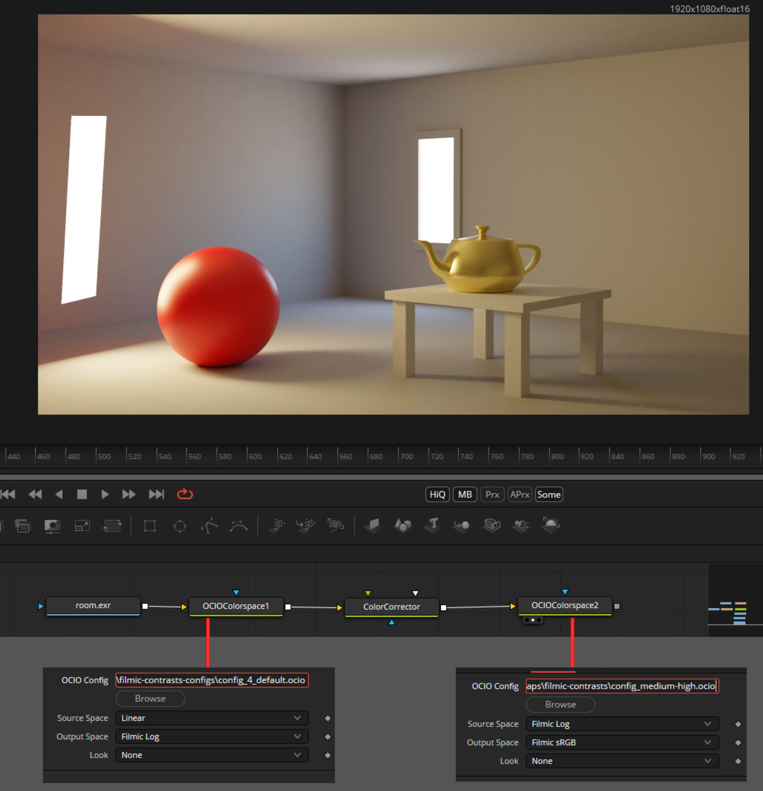
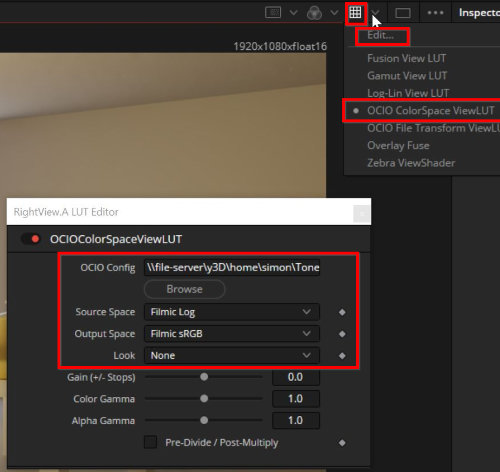

# Filmic Resolve & Fusion

## What is it?
This is a repository to use [Filmic](https://github.com/sobotka/filmic-blender) in Fusion / Resolve. It will allow you to work with Filmic Base Log Encoded or linear files.

## Why?
Sadly Fusion / Resolve 17 broke  [Troy Sabotkas Filmic Resolve](https://github.com/sobotka/filmic-resolve/fork) because Cube Luts get weird artifacts when used with values >1. Also ocio Looks (Filmics Low- / High Contrast Looks) apparently don't work with Fusion. This Repository solves this by providing 7 different config.io files to get all contrast Looks to work inside Fusion.

## How is it used?

1. [Download the latest Release](https://github.com/SimonStorlSchulke/filmic-resolve-fusion/releases/tag/release).
2. Extract it anywhere
3. In Fusion, add your Source Footage (should be linear exr Files).
4. Then add two OCIO Colorspace Nodes.

> In the first one: Load the *config_4_default.ocio* File (or one of the others - doesn't matter here), set Source Space to Linear and Output Space to Filmic Log.

> In the second one, choose the config....ocio File you want from the seven contrast options and set Source Space to Filmic Log and Output Space to Filmic sRGB.

5. All your Color Correction should happen in Filmic Log colorspace - between the two Nodes. If you render directly in Filmic Log space, you can of course skip the first OCIO Node. If you don't do any colorcorrection, you can also directly convert from linear to Filmic sRGB.

6. You can then connect the second OCIO Node to a saver or do whatever with it.

> **Tipp** You can also preview in Filmic sRGB via Fusions LUT View. Enable it, choose OCIO ColorSpace View LUT, click Edit, choose the File, set Output Space to Filmim sRGB and input space to linear or Fiolmic log (depending on what colorspace you want to view with it.)  

## What is the colourimetry of Filmic?
Please see the original repository for full colourimetry information.

TL;DR: The colourimetry of Filmic is based on BT.709 based primaries. The Filmic Log Encoding Base is a pure, normalized
log base two encoding, anchored around a middle grey value of `0.18`, with a +6.5 to -10.0 EV range. The gamut mapping
will properly map out of gamut values on the high intensity end to appropriate display referred output values.
